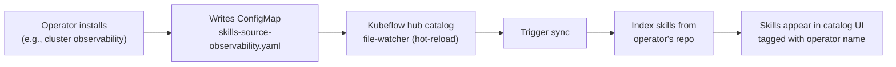

# Skills Catalog Architecture Refresh (August 2026)

Prior research established the hub extension pattern (03-architecture, 2026-07-23), supply chain pipeline, OCI artifact distribution, and installer architecture (06-architecture-refresh, 2026-07-30). This document addresses the architectural implications of four discoveries since 2026-07-30:

1. **Compass/UIE**: an alternate registry layer with scorecards and marketplace publishing that RHAI was unaware of
2. **OCP5 distribution model**: operator-gated skills as core payload + layered product bundles
3. **No portfolio owner**: governance gap across RHAI/OCP5/UIE/partnership with no unified authority
4. **KEP-0005 merged**: kubeflow/hub skills catalog implementation provides concrete plugin architecture

These discoveries expose architectural tensions between centralized vs federated models, single vs multi-registry patterns, and content ownership boundaries.

## 1. Three-Layer Decomposition: Content / Registry / Distribution

The industry is converging on a three-layer separation of concerns that maps directly to RHOAI's architectural choices.

### 1.1 The Three Layers

| Layer | Purpose | RHOAI Components | Source of Truth |
|---|---|---|---|
| **Content** | Skill source code (SKILL.md + scripts) in versioned repositories | Git repos (GitHub/GitLab/internal), skills-content image (disconnected) | Git repositories, never duplicated |
| **Registry** | Metadata lifecycle, governance state, relationships, compliance | MLflow skill registry (RFC-0008), Compass (UIE), kubeflow/hub index (temporary cache) | Registry databases (ephemeral vs durable split) |
| **Distribution** | Packaging, signing, mirroring, installation | OCI artifacts (strategic), npx/git clone (tactical), operator bundles (OCP5), marketplace.json endpoints | OCI registries, catalog endpoints, operator catalogs |

This separation is not theoretical. Skilldex (arxiv:2604.16911v1, April 2026) implements it explicitly: registry is metadata-only with `source_url` pointing to GitHub; installation fetches directly from repositories. The registry never stores skill content, yielding "near-zero infrastructure cost, inherits GitHub's reliability and versioning, and lets authors retain update authority."

### 1.2 KEP-0005 Architecture: Git as Single Source of Truth

KEP-0005 (merged into kubeflow/hub) codifies this principle: "git repositories are the only place skills actually live; everything else is a view onto them." The architecture enforces two invariants:

1. **Postgres is a temporary cache**, rebuilt by reading git. Repositories are never stored.
2. **One parser (in Hub)**, fed by source files. Spec changes are implemented once; metadata refreshes from repositories on every sync.

The sync flow (KEP-0005 §4) reads each listed repository at each listed ref, makes a temporary lightweight copy for parsing only, finds and parses SKILL.md files, rebuilds the index, then deletes the temporary copy. Skills, refs, repositories, or sources that have been removed are cleaned up. The index is a temporary cache, so internal IDs are not stable. The canonical identity is `(repository, path, version)` — the upstream repository URL plus the skill's directory plus the ref.

**Design implication for RHOAI**: The catalog backend (kubeflow/hub plugin) should never store skill content. Skill bodies, scripts, and assets remain in Git. The catalog indexes metadata for discovery; the runtime fetches content directly from the same Git sources. This aligns with the OCI artifact strategy (06-architecture-refresh): OCI layers package Git content, but Git remains the source of truth that OCI artifacts reference via immutable commit SHAs.

### 1.3 Two Planes, One Meeting Point

KEP-0005 §2 describes the separation as two planes:

- **Metadata plane** (for browsing and choosing): resolve → scan → parse → Postgres temporary cache → REST API / UI / marketplace.json
- **Content plane** (for obtaining and running): git sparse checkout / clone → assembler / npx / manual copy

Both planes read the same repositories, so they can never drift apart. They meet only at the canonical identity `(repository, path)`. The catalog's role is to surface the identity; the consumer's git client fetches the content.

**Contrast with Compass/MLflow split**: Compass (UIE) and MLflow (RHAI) are both registry-layer components. Neither stores skill content. But they govern different metadata:

| Registry | Metadata Owned | Authority | Lifecycle |
|---|---|---|---|
| Kubeflow/hub catalog | Discovery metadata (tags, categories, filters) | Catalog admins (source YAML) | Rebuilt on every sync, ephemeral |
| MLflow skill registry | Governance metadata (approval status, usage analytics, relationships) | PM/governance team | Durable, append-only |
| Compass (UIE) | Scorecards (gold=public, silver=internal), security audits, evaluations | UIE product team | Durable, scorecard-driven |

The architectural question is not "which registry wins" but "how do three registries with different authorities share one content layer?"

## 2. Compass vs MLflow: Coexistence Patterns for Multi-Registry Architecture

The 2026-08-04 cross-product meeting revealed a major alignment gap: RHAI team building MLflow-based registry, UIE building Compass-based registry, neither aware of the other. Adel framed Compass as metadata registry overlapping with MLflow's registry layer; proposed separating content (where skills live) from registry (metadata lifecycle) from distribution (OCI, Lola, marketplace).

### 2.1 Registry Architecture Pattern: Compass as Metadata Hub

Compass is not MLflow. Compass (Atlassian lineage, now phased out for new Atlassian customers but adopted internally by Red Hat UIE) is a component catalog with scorecard-based health tracking. From the search results: "scorecards are a set of criteria that you can apply to a component to measure its health." Red Hat Developer Hub (RHDH) integrates Compass via the Scorecard plugin to "assess the health, security, and compliance of services in one place."

MLflow Model Registry (and by extension, the proposed MLflow skill registry in RFC-0008/PR #26) is a lifecycle tracker with versioning, aliasing, stage transitions (Staging → Production), and lineage. From the MLflow docs: "a centralized model store with APIs and UI designed to collaboratively manage the full lifecycle of machine learning models, providing lineage, versioning, aliasing, and metadata tagging support."

**Overlap**: both store metadata about assets and provide governance signals. **Divergence**: Compass emphasizes scorecards and compliance checks; MLflow emphasizes versioning and stage promotion.

### 2.2 Federated Registry Pattern: Registry-as-View-on-Registry

The industry pattern for multi-registry coexistence is federation with a lightweight synchronization layer. From the web search results on federated registry patterns:

- **Federated asset appears alongside locally registered assets** and inherits the same access control, audit logging, and security scanning
- **Large enterprises typically run multiple registries** — one per line of business, alongside agents in SaaS platforms and assets from public registries
- **For discovery, builders search their own registry first** and can search at the centralized registry if needed
- **For governance, each line of business controls what they offer** to their team and can contribute to the centralized registry

The MDM (Master Data Management) registry pattern is directly applicable: "source applications remain the system of record. The MDM hub stores only IDs, matching keys, and minimal metadata, and when an application requests master data, the hub resolves the entity using its index and federates the query back to the originating systems to retrieve complete details in real time."

**Applied to skills catalog architecture**:

1. **Kubeflow/hub catalog** is the discovery layer (read-only, rebuilt from Git)
2. **MLflow skill registry** is the RHAI governance layer (lifecycle state, approval workflow)
3. **Compass** is the UIE governance layer (scorecards, security audits, marketplace publishing approvals)
4. **Git repositories** are the content layer (single source of truth, never duplicated)

The catalog queries both MLflow and Compass at display time via a federated lookup. A skill's catalog entry shows:

- **Identity and discovery metadata** from the catalog's own index (rebuilt from Git)
- **RHAI governance state** from MLflow (if the skill is registered there): approval status, usage analytics
- **UIE governance state** from Compass (if the skill is registered there): scorecard rating (gold/silver), security audit status

Neither MLflow nor Compass stores skill content. Both reference skills by `(repository, path, version)` — the canonical identity. The catalog is the meeting point where all three views converge.

### 2.3 Bi-Directional Sync vs Query Federation

Two integration patterns exist:

| Pattern | Mechanism | Consistency | Complexity |
|---|---|---|---|
| **Bi-directional sync** | Periodic sync writes Compass scorecard results into MLflow customProperties; MLflow approval status writes back to Compass | Eventually consistent | High: conflict resolution, sync storms, ownership boundaries |
| **Query federation** | Catalog queries both registries at display time; user actions (approve in MLflow, publish via Compass) write to the authoritative registry only | Immediately consistent (read-your-writes per registry) | Medium: multiple API calls, performance, partial availability |

The MDM registry pattern recommends query federation: "the hub resolves the entity using its index and federates the query back to the originating systems to retrieve complete details in real time." Bi-directional sync creates the problem Roland Huss identified in the metadata debate: "splitting metadata creates sync risk."

**Design recommendation**: Query federation with cache. The catalog backend queries MLflow and Compass APIs at detail-view time (not at list-view time, for performance). Results are cached with a short TTL (5-15 minutes). The catalog UI shows a unified view:

```
Skill: deploy (v1.2.3)
├─ Identity: github.com/acme/skills → skills/deploy
├─ Discovery: category=DevOps, trustTier=partnerVerified (from catalog source YAML)
├─ RHAI Governance: approved for RHOAI 3.2, 47 installs last 30 days (from MLflow API)
└─ UIE Governance: scorecard=gold, security audit passed 2026-07-15 (from Compass API)
```

Neither registry overwrites the other. The catalog orchestrates the unified view but does not store governance state.

### 2.4 Architectural Implication: No Unified Skills Repo Without Portfolio Owner

The 2026-08-04 meeting surfaced the Nvidia model as the target: "centralized repo + security pipeline + validated output." Greg Bowman to share UIE's requirements for a skills repo; Adel to share the MLflow RFC. Goal: determine if a single Red Hat skills source-of-truth repo is feasible.

**Architectural blocker**: No portfolio owner means no authority to enforce a unified repo. The gap is not technical (Git supports multi-team contribution via CODEOWNERS, protected branches, and PR approval workflows). The gap is organizational: who decides which skills are "Red Hat skills"? Who owns the quality bar? Who arbitrates conflicts between OCP5 troubleshooting skills and RHAI troubleshooting skills?

The early MCP pattern repeated: "everybody was kind of doing their own thing instead of having one standard around those. And it came back to bite us when we tried to find a standard for including it into the OpenShift AI area."

**Federated architecture as mitigation**: The three-layer model supports federation by design. Multiple Git repos (OCP5 core skills repo, RHAI skills repo, UIE skills repo, partner repos) can coexist as separate catalog sources. Each repo has its own owner, quality bar, and contribution workflow. The catalog federates discovery; the registries (MLflow for RHAI, Compass for UIE) govern independently. The distribution layer (OCI artifacts, operator bundles) packages from any source repo.

This is not ideal — it creates discoverability fragmentation and trust-tier ambiguity — but it is defensible when governance fragmentation is an organizational reality. The architecture should not assume a unified repo will exist.

## 3. Kubeflow Hub Skills Plugin Architecture (KEP-0005)

KEP-0005 provides the concrete implementation architecture for the catalog layer. Key patterns:

### 3.1 Source Provider Pattern

A new source type `git-skills-plugin`, following hub's convention (`yaml`, `hf`). Sources list git repositories, refs (tags/releases/branches/commits), and custom metadata (trust tier, provider, category, labels). The source file is the admin-curated routing table.

```yaml
- name: Red Hat Core Skills
  id: rh-core-skills
  type: git-skills-plugin
  enabled: true
  trustTier: platformProvided
  repositories:
    - url: https://github.com/openshift/core-agentic-skills.git
      refs: [v1.0, v1.1, main]  # each ref → separate catalog entries
      provider: Red Hat
      category: Platform
      skillOverrides: [{name: troubleshoot, category: Observability}]
```

Each time the catalog syncs, the plugin reads each listed repository at each listed ref, makes a temporary lightweight copy for parsing only, rebuilds the index, and deletes the copy. The source file can live inline (UI-added sources, written to user-managed ConfigMap) or via a file path (`yamlCatalogPath`, for shipped defaults bundling many repos).

**Design implication**: Federated source management. OCP5 maintains its own source YAML (core skills + layered product skills). RHAI maintains its own source YAML (RHOAI-specific skills). UIE maintains its own source YAML (Compass-indexed skills). The catalog deployment merges all three as default sources (read-only) plus a user-managed ConfigMap for org-approved and community sources. The BFF settings UI writes the user-managed ConfigMap; shipped defaults are read-only.

### 3.2 Versioning and Reproducibility

KEP-0005 §2: "A skill's `version` is the ref (a branch is surfaced as `latest`, not the branch name), and the exact commit it resolved to is recorded as `resolvedCommit`." Every catalog entry pins to a commit SHA, so installs are reproducible even for `latest`. The marketplace.json endpoint exposes all refs as separate plugin entries, each pinned to its `resolvedCommit`.

**Design implication**: OCI artifact builds reference the same commit SHAs. When the catalog indexes `github.com/acme/skills → skills/deploy @ main → resolvedCommit: abc123`, the OCI artifact build for that skill uses `abc123` as the source ref. The catalog and OCI distribution layer share the same reproducibility anchor.

### 3.3 Custom Metadata Ownership Boundary

KEP-0005 §6: "Trust tier, provider, category, and labels come from the source file and are applied to its skills at sync time — they are never read from the repository's content." SKILL.md frontmatter cannot set `trustTier`. That field is admin-curated in the source YAML, controlled by whoever has ConfigMap/GitOps access.

This is the governance boundary: skill authors own the skill body (instructions, scripts, references); catalog admins own the trust tier, provider, and category. `customProperties` in SKILL.md frontmatter are preserved but do not override catalog metadata.

**Design implication**: When Compass assigns a scorecard rating, that is governance metadata (UIE authority). When MLflow records approval status, that is governance metadata (RHAI authority). When the catalog source YAML sets `trustTier: platformProvided`, that is discovery metadata (catalog admin authority). All three are separable and do not conflict because they have different owners.

### 3.4 Disconnected Architecture: Self-Serving Skills-Content Image

KEP-0005 Part II: disconnected support is "just configuration plus one optional Deployment." A `skills-content` image contains clones of all repositories plus a built-in git server (`skills-git-server`, a small Go binary serving `/content/repos` over git HTTP protocol via `git http-backend`).

The image serves itself: run the image and it is a git server; mount or copy from it and it is just data. The catalog's disconnected source files point to the mirror URLs; the plugin's only change is configuration (`skill_content_mirror: {internalBaseUrl, externalBaseUrl}`). The catalog queries the mirror at sync time; the assembler checks out skills from the mirror; laptops on the internal network use the mirror's external Route.

**Design implication**: The OCP5 operator-gated distribution model can coexist with the skills-content mirror. Core payload skills ship as OCI artifacts in the core payload image; the skills-content mirror provides the git backing for the catalog to index them. Layered product skills (e.g., troubleshooting → cluster observability operator) ship with their operator bundles as OCI artifacts; the catalog indexes them from operator-provided source YAMLs that reference the mirrored repos.

## 4. Catalog-to-Registry Integration: Orchestration, Not Protocol

The question from 03-architecture remains: "how does a catalog-installed skill integrate with the registry?" The answer is BFF orchestration, not a new protocol.

### 4.1 Three Integration Points

| User Action | BFF Logic | Registry API Call |
|---|---|---|
| "Register this skill" (catalog detail page) | Catalog BFF extracts `(repository, path, version)` identity | `POST /mlflow/skill_registry/skills` with `source_url`, `source_commit`, metadata |
| "Approve for RHOAI" (MLflow UI) | MLflow BFF updates approval status | `PATCH /mlflow/skill_registry/skills/{id}/stage` → `Production` |
| "Publish to marketplace" (Compass UI) | Compass BFF updates scorecard and triggers marketplace sync | Compass API → marketplace publishing pipeline |

The catalog, MLflow, and Compass are three separate UIs with three separate BFFs. No direct catalog-to-registry protocol exists. Users navigate between them via hyperlinks: the catalog detail page links to "View in MLflow registry" and "View in Compass" (if registered). The MLflow skill detail page links back to "Browse in catalog."

### 4.2 Optional: Catalog as Registry Client

For user convenience, the catalog BFF can offer a "Register in MLflow" button on the skill detail page. This is pure orchestration: the BFF calls the MLflow API on the user's behalf, then redirects to the MLflow UI. The catalog does not store registration state. The next time the user views the skill in the catalog, the catalog queries MLflow to check if it is registered (query federation, §2.3).

**Design implication**: The catalog and registry layers are loosely coupled via REST APIs and hyperlinks. The integration is client-side orchestration (BFF calls both APIs) rather than server-side synchronization. This aligns with the federated pattern: each layer is independently operable.

## 5. OCI Distribution Convergence and OCP5 Operator-Gated Model

06-architecture-refresh identified OCI distribution as "the strategic convergence point: same registries, same mirrors, same signing, same tooling as containers." The OCP5 distribution model (2026-08-04 discovery) confirms this direction.

### 5.1 OCP5 Distribution Model

Ju Lim described the model:

- **Core payload skills**: shipped as a single image containing all core agentic skills (in the core payload)
- **Layered product skills**: ship with the component's operator (troubleshooting skill → cluster observability operator; update-related skill → TechPreview component short-term, core payload long-term)
- **Gating model**: skill is available only if the associated operator is installed
- **Source repos**: one GitHub repo for core skills; layered product skills live in their own repos
- **Distribution format**: GitHub repo → OCI image (via supply chain pipeline). "We like the Nvidia pipeline too."

Peter emphasized operator gating as "an upsell mechanism and dynamic catalog enrichment: if you are installing that, you have installed it, so therefore it needs to dynamically be added to the catalog."

### 5.2 Dynamic Catalog Enrichment Architecture

KEP-0005 supports this via hot-reload: the catalog sources are ConfigMaps watched by a file-watcher. When a new operator installs, it can write a ConfigMap with a new catalog source pointing to the operator's skill repo. The catalog detects the change, triggers a sync, indexes the new skills, and they appear in the catalog UI.

The OpenShift catalogd architecture (from web search) supports this pattern: "catalogd unpacks file-based catalog (FBC) content for on-cluster clients... file-based catalogs are the latest iteration of the catalog format in Operator Lifecycle Manager (OLM) v1."

**Integration pattern**:



The operator's skill repo is packaged as an OCI artifact and mirrored via oc-mirror for disconnected. The operator bundle includes the skills OCI artifact plus the source YAML ConfigMap.

### 5.3 OCI Artifact Packaging for Skills

The agentskills.io specification (Thomas Vitale, draft v0.1.0, April 2026) defines OCI artifact packaging for skills. From the web search:

- **Skill Artifact**: OCI Image Manifest with `artifactType: application/vnd.agent-skills.skill.v1`. SKILL.md, scripts, and resources packaged as content layers.
- **Collection Artifact**: OCI Image Index referencing individual Skill digests by name (same construct as multi-platform images).
- **Consumer-side**: `skills.json` (declarative manifest) + `skills.lock.json` (pinned to immutable digests, not mutable tags).

The skills-oci CLI (Mauricio Salatino, ORAS Go client) and skillctl (enterprise-grade CLI) implement the spec. JFrog's partnership with NVIDIA (March 2026) validates the pattern: "JFrog Artifactory will serve as a registry for AI models and agent skills with NVIDIA AI-Q Blueprint, as part of NVIDIA Agent Toolkit."

**Design implication for RHOAI**: Skills packaged as OCI artifacts can be:

1. **Signed** with Sigstore's Cosign, include SLSA provenance attestations, embed SBOMs, and include vulnerability scan results (via OCI Referrers API)
2. **Mirrored** with oc-mirror, skopeo copy, crane pull — the same tooling as container images
3. **Stored** in Harbor, Zot, Quay — the registries already serving container images

The catalog indexes skills from Git (metadata plane); OCI artifacts package skills from the same Git commits (content plane). Both reference the same `resolvedCommit` SHA. The OCI artifact is the distribution primitive; Git is the source of truth; the catalog is the discovery layer.

### 5.4 Disconnected Delivery: OCI Mirror vs Git Mirror

KEP-0005 Part II provides git mirroring via the skills-content image. The OCI artifact strategy provides OCI mirroring via oc-mirror. Which is preferred?

**For content delivery to agent runtimes**: OCI is preferred. The agent runtime (OpenShell containers, Kata sandboxed pods) can mount OCI artifacts as volumes via the CSI driver. The skill content is immutable, signed, and scanned. The runtime does not need git or network access.

**For catalog indexing (metadata plane)**: Git is preferred. The catalog needs to parse SKILL.md frontmatter, not execute the skill. Reading from Git (either live repos or the skills-content mirror) is simpler than unpacking OCI layers. The catalog sync is an admin-triggered batch operation, not a runtime hot-path.

**Resolution**: Both coexist. The catalog indexes from Git (live or mirrored). The runtime installs from OCI artifacts (live or mirrored). The build pipeline bridges them: skills-content CI clones Git repos → builds OCI artifacts referencing the same commit SHAs → publishes both the OCI artifacts and the skills-content git mirror image. The catalog and runtime share the same `(repository, path, resolvedCommit)` identity but consume different representations.

## 6. Architectural Implications Summary

### 6.1 Content / Registry / Distribution Separation

| Layer | RHOAI Implementation | Authoritative Store | Consumers |
|---|---|---|---|
| **Content** | Git repos (GitHub/GitLab/internal for connected; skills-content image for disconnected) | Git, never duplicated | Catalog sync (metadata extraction), OCI build (artifact packaging), runtime (git sparse checkout or OCI mount) |
| **Registry** | MLflow skill registry (RHAI governance), Compass (UIE governance), kubeflow/hub index (temporary cache) | MLflow and Compass databases (durable); hub index rebuilt on sync (ephemeral) | Catalog UI (query federation), approval workflows, scorecard dashboards |
| **Distribution** | OCI artifacts (strategic), operator bundles (OCP5), marketplace.json (Claude Code), npx/git clone (tactical) | OCI registries (Quay, internal mirror), operator catalogs (OLM), catalog endpoints | Agent runtimes, laptops, CLI installers |

The architectural principle: **Git is the only lasting store of content and source of metadata**. Everything else is a view, a cache, or a packaging.

### 6.2 Multi-Registry Coexistence via Query Federation

Compass and MLflow coexist as independent governance layers:

- **MLflow**: RHAI approval workflow, usage analytics, version relationships
- **Compass**: UIE scorecards (gold/silver), security audits, marketplace publishing approvals
- **Integration**: Query federation at catalog display time; no bi-directional sync; each registry owns its governance domain

The catalog shows a unified view; neither registry overwrites the other.

### 6.3 Federated Source Management (No Unified Repo Assumption)

The no-portfolio-owner gap means the architecture must support multiple source repos:

- **OCP5 core skills repo**: platform team authority
- **RHAI skills repo**: RHOAI product team authority
- **UIE skills repo**: UIE product team authority
- **Partner repos**: partner authority with Red Hat review
- **Org-approved repos**: customer authority (added via catalog settings UI)
- **Community repos**: community authority (added via catalog settings UI)

Each repo has its own CODEOWNERS, PR approval workflow, and quality bar. The catalog federates discovery via multiple source YAML files (one per authority). Trust tiers differentiate: `platformProvided` (RH core), `partnerVerified` (partner with RH review), `organizationApproved` (customer-added), `communityContributed` (community).

### 6.4 OCP5 Operator-Gated Dynamic Catalog Enrichment

Operators ship skill OCI artifacts and write catalog source ConfigMaps on install. The catalog hot-reloads, indexes the operator's skills, and displays them with operator-name tags. Users see skills only if the associated operator is installed (gating as upsell + relevance filter).

The pattern reuses OpenShift's existing operator catalog architecture (catalogd, FBC, OLM v1). No new distribution mechanism needed.

### 6.5 OCI + Git Dual Representation

Skills exist in two distribution representations:

1. **Git** (canonical): catalog indexes from Git; developers clone from Git; OCI builds reference Git commit SHAs
2. **OCI artifact** (runtime): signed, scanned, mirrored, mounted into agent pods; reproduced from the same Git commit

The identity `(repository, path, resolvedCommit)` anchors both. The catalog bridges them by displaying both install methods (marketplace.json for git clone, OCI registry URL for container mount).

### 6.6 Catalog-to-Registry Orchestration (BFF, Not Protocol)

No server-side catalog-to-registry protocol. Integration is client-side BFF orchestration:

- Catalog BFF can call MLflow API to register a skill (user convenience)
- Catalog BFF queries MLflow and Compass APIs to display governance state (query federation)
- Users navigate between catalog / MLflow / Compass UIs via hyperlinks

Each layer is independently operable. The catalog works without MLflow; MLflow works without the catalog; Compass works without either.

## 7. Open Architectural Questions

### 7.1 Compass Alignment Session Outcomes

Greg Bowman to arrange a meeting with the Compass team. Outcomes needed:

1. **Capability inventory**: What does Compass already provide that MLflow duplicates? What is Compass-unique?
2. **API surface**: Does Compass expose a REST API for scorecard queries? Can the catalog query it?
3. **Skill identity**: Does Compass use `(repository, path, version)` as the canonical identity, or a different schema?
4. **Unified repo requirements**: What are UIE's requirements for a Red Hat skills repo? Are they compatible with RHAI's and OCP5's requirements?

If Compass capabilities fully cover MLflow's proposed skill registry, the architectural recommendation is to adopt Compass as the registry layer and drop the MLflow skill registry proposal. If they are complementary, the federated pattern (query both) stands.

### 7.2 Skills Installation Target in Agent Runtime

The hardest question from 03-architecture remains: "where does a catalog-installed skill land?" If skills run in OpenShell containers (06-architecture-refresh §5), the install target is either the container image (baked at build time) or a mounted volume (dynamic at runtime).

**Option A: Baked into agent image** → skill updates require image rebuild; no dynamic installation
**Option B: OCI artifact mounted as volume** → CSI driver mounts OCI artifact; skill content read-only; updates via artifact version bump
**Option C: Git clone into ephemeral volume** → init container clones from Git; skill content mutable (breaks reproducibility)

The KEP-0005 assembler pattern (§7, "Agent pods / assembler") suggests Option B or C: the assembler is an init container that checks out skills from Git via sparse checkout, writing to a shared volume. Option B (OCI mount) is the more secure, reproducible path.

**Decision needed**: Which option does RHOAI's agent runtime architecture choose? The catalog architecture is agnostic (it provides both git clone instructions and OCI artifact URLs), but the runtime must pick one as the blessed path.

### 7.3 Light Trail / MCPLO Relationship

The 2026-08-04 meeting mentioned "Light Trail team also building MCP server hosting on MP+ with SSO." How does this relate to MCPLO (MCP Local Orchestrator)? Are they the same project, or parallel efforts?

If Light Trail is MCP hosting (servers run in a managed environment, exposed via marketplace), and MCPLO is MCP orchestration (servers run locally, agent orchestrates them), they are complementary. If they are duplicative, the no-portfolio-owner gap repeats: two teams building overlapping infrastructure.

**Architectural impact**: If Light Trail provides MCP-as-a-service, the skills catalog should link to it (a skill can declare MCP server dependencies; the catalog links to Light Trail's hosted instance). If MCPLO and Light Trail conflict, the catalog should be agnostic and link to both as alternative install methods.

## 8. Key Findings

1. **Three-layer decomposition is the industry pattern**: Content (Git), Registry (MLflow/Compass/hub index), Distribution (OCI/operator bundles/marketplace). Git is the only lasting store; everything else is a view or packaging.

2. **KEP-0005 provides concrete catalog architecture**: Git as single source of truth; Postgres as temporary cache rebuilt on sync; source provider pattern with hot-reload; disconnected support via self-serving skills-content image. The hub extension pattern (03-architecture) is validated upstream.

3. **Compass and MLflow coexist via query federation, not sync**: Registry-as-view-on-registry pattern. Catalog queries both at display time; each registry owns its governance domain. No bi-directional sync (avoids Roland's metadata split risk).

4. **No unified repo is architecturally defensible when no portfolio owner exists**: Federated source management supports multiple repos (OCP5, RHAI, UIE, partner, org, community) with different authorities. Trust tiers differentiate; the catalog federates discovery.

5. **OCP5 operator-gated distribution reuses OpenShift catalog patterns**: Operators ship skill OCI artifacts and write catalog source ConfigMaps on install. Catalog hot-reloads, indexes operator skills, displays them with operator tags. Gating as upsell + relevance filter.

6. **OCI + Git dual representation bridges catalog and runtime**: Catalog indexes from Git (metadata extraction); runtime installs from OCI artifacts (signed, scanned, mounted). Both reference the same `resolvedCommit` SHA. The catalog displays both install methods.

7. **Catalog-to-registry is BFF orchestration, not protocol**: No server-side integration. BFF calls both APIs; users navigate via hyperlinks. Each layer is independently operable.

8. **Disconnected delivery supports both Git and OCI mirrors**: KEP-0005 Part II provides git mirroring (skills-content image). OCI artifact strategy provides OCI mirroring (oc-mirror). Both coexist: catalog indexes from Git; runtime mounts OCI artifacts.

## Sources

- [Skilldex: A Package Manager and Registry for Agent Skill Packages with Hierarchical Scope-Based Distribution](https://arxiv.org/html/2604.16911v1)
- [Agent Skill Composition: The Architecture of Modular AI Capabilities | Zylos Research](https://zylos.ai/research/2026-05-12-agent-skill-composition-modular-capability-architecture/)
- [From Registry to Repository: How AI Agent Skills Are Written, Adapted, and Maintained](https://arxiv.org/html/2607.00911)
- [AI Agent Architecture — The MCP, Skills, and Agent Three-Layer Model](https://shuji-bonji.github.io/ai-agent-architecture/concepts/03-architecture)
- [Managing AI agent skills at scale: a three-repo architecture — Rajiv Pant](https://rajiv.com/blog/2026/03/23/managing-ai-agent-skills-at-scale-three-repo-architecture/)
- [Governing AI Assets at Scale with MCP Gateway and Registry | AWS Open Source Blog](https://aws.amazon.com/blogs/opensource/governing-ai-assets-at-scale-with-mcp-gateway-and-registry/)
- [What is AI Agent Registry - A Complete Guide](https://www.truefoundry.com/blog/ai-agent-registry)
- [Agentic Resource Discovery: Federated Pre-Invocation Search — AgentPatterns.ai](https://www.agentpatterns.ai/standards/agentic-resource-discovery/)
- [Integrating AWS Agent Registry into your agent platform for discovery and governance](https://heeki.medium.com/integrating-aws-agent-registry-into-your-agent-platform-for-discovery-and-governance-3350920204a4)
- [AI Model Governance 2026: Model Registry, MLflow, and Enterprise Compliance](https://www.programming-helper.com/tech/ai-model-governance-2026-model-registry-mlflow-enterprise-compliance)
- [ML Model Registry | MLflow AI Platform](https://mlflow.org/docs/latest/ml/model-registry)
- [Intro to Data Integration Patterns – Bi-Directional Sync | MuleSoft Blog](https://blogs.mulesoft.com/api-integration/patterns/data-integration-patterns-bi-directional-sync/)
- [MDM Integration Architecture: Patterns & Best Practices | Informatica](https://www.informatica.com/resources/articles/mdm-integration-architecture.html)
- [The Architect's Guide to Data Integration Patterns: Migration, Broadcast, Bi-directional, Correlation, and Aggregation](https://medium.com/@prayagvakharia/the-architects-guide-to-data-integration-patterns-migration-broadcast-bi-directional-a4c92b5f908d)
- [GitHub - kubeflow/hub: Model Registry](https://github.com/kubeflow/hub)
- [Overview | Kubeflow](https://www.kubeflow.org/docs/components/hub/overview/)
- [Agent Skills as OCI Artifacts](https://www.thomasvitale.com/agent-skills-as-oci-artifacts/)
- [Specification for Skills Packaging and Distributions as OCI Artifacts](https://github.com/agentskills/agentskills/discussions/292)
- [Manage and distribute skills with skills-oci](https://www.salaboy.com/2026/04/19/manage-and-distribute-skills-with-skills-oci/)
- [skillctl — OCI-Based Skill Distribution](https://skillimage.dev/)
- [Using Harbor as an AI Model Registry - VMware Cloud Foundation (VCF) Blog](https://blogs.vmware.com/cloud-foundation/2026/03/03/using-harbor-as-an-ai-model-registry/)
- [How OCI Artifacts will drive future AI use cases | CNCF](https://www.cncf.io/blog/2025/08/27/how-oci-artifacts-will-drive-future-ai-use-cases/)
- [Deploying Disconnected OpenShift Clusters using oc-mirror v2 on s390x](https://community.ibm.com/community/user/blogs/shreya-hallikeri/2026/04/01/deploying-disconnected-openshift-clusters)
- [Air-Gapped API Testing: Patterns for Classified & IL5/IL6 (2026)](https://totalshiftleft.ai/blog/air-gapped-api-testing)
- [On-Premise AI Architecture: Complete Enterprise Deployment Guide for 2026](https://dev.to/jaipalsingh/on-premise-ai-architecture-complete-enterprise-deployment-guide-for-2026-3ge7)
- [Working with OCI Registries for Helm Charts](https://oneuptime.com/blog/post/2026-01-17-helm-oci-registries-charts/view)
- [Use OCI-based registries | Helm](https://helm.sh/docs/topics/registries/)
- [JFrog Delivers Trust Layer for AI-Driven Software with NVIDIA](https://jfrog.com/press-room/jfrog-delivers-trust-layer-for-ai-driven-software-with-nvidia/)
- [JFrog Announces New JFrog Agent Skills Registry](https://www.sahmcapital.com/news/content/jfrog-announces-new-jfrog-agent-skills-registry-for-agentic-workforces-to-operate-securely-at-enterprise-speed-and-scale-2026-03-16)
- [Catalogs | Extensions | OpenShift Container Platform](https://docs.redhat.com/en/documentation/openshift_container_platform/4.18/html/extensions/catalogs)
- [GitHub - openshift/operator-framework-catalogd](https://github.com/openshift/operator-framework-catalogd)
- [Agent Skills Explained: SKILL.md Format and Adoption (2026)](https://atlan.com/know/ai-agent/ai-agent-skills/what-are-agent-skills/)
- [The Three Layers of an Agentic AI Platform | Bain & Company](https://www.bain.com/insights/the-three-layers-of-an-agentic-ai-platform/)
- [Evaluate project health using Scorecards | Red Hat Developer Hub](https://docs.redhat.com/en/documentation/red_hat_developer_hub/1.9/html-single/evaluate_project_health_using_scorecards/index)
- [KEP-0005: Skill Catalog Plugin](https://github.com/kubeflow/hub/blob/main/proposals/KEP-0005-skills-catalog/README.md) (internal reference, not public)
- [KEP-0005 Architecture Document](https://github.com/kubeflow/hub/blob/main/proposals/KEP-0005-skills-catalog/skill-catalog-architecture.md) (internal reference, not public)
