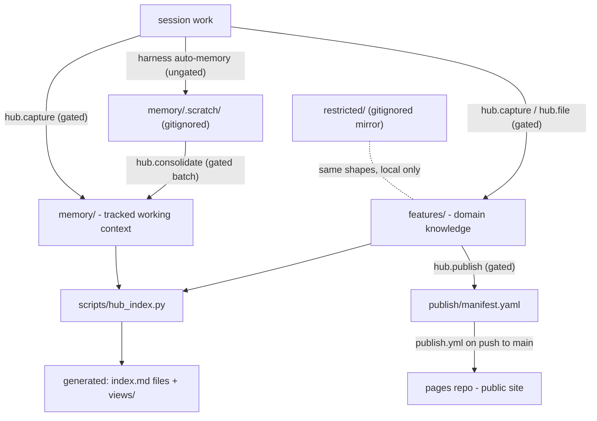

# Architecture — how the hub fits together

This explains the system: what the pieces are, how information flows through
them, and why they are shaped this way. The **rules** live in
[/conventions/](/conventions/) — short, normative, CI-enforced — and win over
anything here on conflict. Deep dives: [memory](/docs/memory.md) ·
[skills](/docs/skills.md) · [publishing](/docs/publishing.md) ·
[tooling](/docs/tooling.md) · [lineage](/docs/history.md).

## What this repo is

One repo holding everything Peter's Red Hat OpenShift AI PM work produces and
needs — domain knowledge, working memory, research, strategy, enablement
artifacts — plus the skills and scripts that keep it organized, healthy, and
selectively published. It is built for **humans and agents as co-equal
operators**: every convention must be readable by a person and deterministic
for an agent.

The charter (2026-07-05) named five problems this design must fix, each with
a concrete mechanism:

| problem | mechanism |
|---|---|
| Information lands in inconsistent places | one routing rule — **feature × type** — answers where everything goes |
| Every addition is an ad-hoc filing decision | typed entries with fixed shapes; skills make filing mechanical |
| Changed facts get re-explained every session | `memory/` profiles updated in place + an always-loaded index |
| The knowledge registry outgrew one file | feature partitions replace the old 1,105-line monolith |
| Bus-factor of one | conventions + these docs + the doctor: operable without Peter in the room |

## Information flow

Two gates stand between a session and the outside world: nothing enters the
**tracked stores** without an inline human approve (the capture gate), and
nothing reaches the **public pages site** without a manifest entry (the
publish gate). Everything generated in between is derived, deterministic, and
CI-verified.

## Top-level anatomy

| path | holds | authored by |
|---|---|---|
| `features/<id>/` | all content for one feature area | humans + skills |
| `features/features.yaml` | the feature routing table | `hub.file` (partition creation) |
| `narrative/<skeleton>` | the story layer: pillars, cross-feature stories, strategy spine | humans + skills |
| `memory/` | working context: profiles, facts, log | the gate only |
| `conventions/` | the normative rulebook | humans (rarely changes) |
| `views/` | cross-cutting generated indexes | `hub_index.py` only |
| `publish/manifest.yaml` | the public-site allowlist | `hub.publish` |
| `restricted/` | gitignored mirror for NDA content | same rules, local only |
| `scripts/` | linter, indexer, publisher, doctor, tests | humans |
| `docs/` | these guides | humans |
| `.claude/skills/` | the skills (see [/docs/skills.md](/docs/skills.md)) | humans |

## The filing questions

Every addition answers exactly two questions — this is the core standard that
replaces per-addition judgment calls:

1. **Which home?** Story-shaped content (pillars, cross-feature stories, the
   strategy spine) → `narrative/`; everything else picks its feature:
   `features/features.yaml` is the routing table. Current partitions:
   skills-registry, mcp-gateway, mcp-registry, mcp-ecosystem,
   agent-registry, agent-memory, agent-ops, gen-ai-studio, and `platform`
   (the cross-cutting pseudo-feature for releases, people, personas, SKUs,
   org strategy). New partitions are created by `hub.file` on first use —
   never by hand.
2. **Which type?** [/conventions/type-vocabulary.md](/conventions/type-vocabulary.md)
   defines the vocabulary: knowledge entries are `decision` / `fact` /
   `reference` / `person` / `question` (with matching filename prefixes);
   memory files are `profile` / `fact` / `preference` / `feedback`.

Every feature partition has the identical skeleton — subdirectories are
created on first use, never pre-created empty, and anything else is a lint
error:

| dir | holds |
|---|---|
| `knowledge/` | typed entries only, plus generated `index.md` |
| `research/` | deep documents (numbered series optional) |
| `strategy/` | strategy docs, RFE roadmaps, outcomes |
| `enablement/` | one self-contained subdirectory per artifact (deck, hub site, blog) |
| `work/` | active drafts, RFE pipeline artifacts, `transcripts/` (gitignored) |

**Working context vs domain knowledge:** "the 3.5 date moved" is memory;
"how the gateway does authz" is knowledge. The boundary rule lives in
[/conventions/memory.md](/conventions/memory.md), with worked examples in
[/docs/memory.md](/docs/memory.md).

## Generated vs authored

Every generated file begins with the marker
`<!-- generated by scripts/hub_index.py — do not hand-edit -->`. The
generated set: `features/index.md`, every `features/*/index.md` and
`features/*/knowledge/index.md`, `memory/index.md`, and everything in
`views/`. Regenerate with `python scripts/hub_index.py`; CI fails the build
when any of them is stale, so hand-edits cannot survive.

`views/` gives cross-cutting answers that the per-feature layout would
otherwise hide, derived entirely from entry frontmatter:

| view | derived from |
|---|---|
| `views/decisions.md` | all `decision` entries, newest first |
| `views/open-questions.md` | all `question` entries with `status: open` |
| `views/people.md` | all `person` entries, grouped by feature |
| `views/jira-map.md` | Jira keys found in `resource:` fields → the entry that covers them |
| `views/stale-facts.md` | entries past `review_after` or the staleness defaults |
| `views/narrative-map.md` | pillars → stories → the features each story connects |
| `views/faq.md` | all `qa` entries — unanswered, most-asked (by `asks:` count), by feature |
| `views/jtbd.md` | all `jtbd` entries by status × feature, evidence-count flagged |
| `views/artifacts.md` | every enablement artifact + publish state from the manifest |

## The trust model

The repo is **public**; treat every tracked write as world-readable. Three
layers keep that safe:

1. **The capture gate** — no agent writes the tracked memory store or
   knowledge entries without an inline human approve, and every promotion
   gets an explicit public-vs-restricted call.
2. **`restricted/`** — a gitignored local mirror (`restricted/features/…`,
   `restricted/memory/…`) with the same shapes and conventions. The
   restricted bar (what must go there) is codified in
   [/conventions/memory.md](/conventions/memory.md). The linter also runs a
   restricted-content heuristic over tracked files and warns on matches.
3. **The publish allowlist** — the public pages site only ever receives what
   `publish/manifest.yaml` names. The failure mode is *forgot to publish*,
   never *leaked by default*.

## Publishing is decoupled

Knowledge lives here; **published artifacts live in a separate repo**
([solaius/rhoai-agentic-hub-pages](https://github.com/solaius/rhoai-agentic-hub-pages)),
pushed by CI from the manifest. That decoupling means this repo could go
private or move (e.g., VPN GitLab for Red Hat-internal knowledge) without
breaking a single published URL, and a future `audience: internal` target can
be added without touching the public one. Full pipeline:
[/docs/publishing.md](/docs/publishing.md).

## Conformance: OKF v0.1

Entry shapes follow the Open Knowledge Format v0.1 (pinned as of
2026-07-05): markdown + YAML frontmatter, `type` required on every entry,
`index.md` and `log.md` reserved. Local extensions (documented producer
extensions per OKF §4.1): `status: current|superseded`, `valid_from`,
`superseded_by`, `review_after`, `source`. Superseded entries are never
deleted — history stays traversable.

## The eleven design decisions

The design specs settled these (D1–D11; D12–D16 from [/docs/specs/2026-07-08-narrative-layer-design.md](/docs/specs/2026-07-08-narrative-layer-design.md)); they govern everything above.
Full text: the [design spec](https://github.com/solaius/ai-asset-registry/blob/main/docs/superpowers/specs/2026-07-05-rhoai-agentic-hub-design.md).

| # | decision |
|---|---|
| D1 | single-writer v1 (Peter + agents), documented-but-dormant contributor path |
| D2 | Claude Code is the verified harness; Cursor validated post-build |
| D3 | harness auto-memory redirected to `memory/.scratch/` (the scratch tier) |
| D4 | inline approve→commit gate on all tracked-store writes, incl. disclosure check |
| D5 | dedicated pages repo + allowlist manifest for publishing |
| D6 | old repo untouched; content migrates on touch via `hub.migrate` |
| D7 | full successor — daily work moves here, not a partial experiment |
| D8 | skills are reviewed/enhanced ports, never lift-and-shift; shared skills come from the ODH marketplace |
| D9 | feature-partition layout (one axis: feature × type) |
| D10 | OKF v0.1 conventions + documented local extensions |
| D11 | hybrid skill architecture: `hub.*` operational + first-party content + marketplace |
| D12 | the connection layer is a top-level `narrative/` tree (peer of `features/`, same skeleton), never a pseudo-feature |
| D13 | `features:` cross-reference field, validated against `features.yaml`; connections are declared then generated, never hand-maintained |
| D14 | type vocabulary extension: `pillar`/`story` (narrative-only), `qa`/`jtbd` (any knowledge), `artifact` descriptors + four views |
| D15 | execution status stays in Jira — `jtbd` tracks the job's truth (`candidate→validated→delivered`, `retired`), `jira:` points at delivery |
| D16 | capture-first, publish-later: FAQ/JTBD views repo-internal; curated publishing and the Slack sweep are Phase 2, pulled by demand |

## Lineage

This repo is the intentionally-designed successor to
[ai-asset-registry](https://github.com/solaius/ai-asset-registry). The
charter, design spec, implementation plan, and the full migration audit trail
live there — pointers and the story: [/docs/history.md](/docs/history.md).
