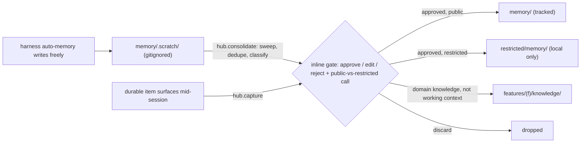

# The memory system

Why a memory system at all: the charter ranked the goals **B → A → C** —
**capture-as-you-go** first (catch decisions, links, and date changes the
moment they surface), **cross-session continuity** as the payoff (any future
session or teammate resumes current, nobody re-explains a moved date), and
**dogfooding product memory** deferred until the RHOAI agent-memory direction
firms up. Normative rules: [/conventions/memory.md](/conventions/memory.md).

The design in one paragraph: memory is **in-repo, harness-agnostic, versioned
markdown** — it travels with `git clone`, and any agent that can read files
can use it. There are two tiers: an ungated **scratch tier** that harness
auto-memory writes freely, and a **tracked store** that nothing writes
without an inline human approve. Because this repo is public, that gate
doubles as a disclosure check.

## Two tiers



## Anatomy of `memory/`

| path | what it is | write discipline |
|---|---|---|
| `index.md` | the always-loaded tier — profiles, recent facts, recent log in one page | GENERATED, ≤200 lines (CI-enforced) |
| `profiles/` | one file per volatile subject — `now`, `roadmap`, `strategy`, `preferences` | **update in place**; old value moves to the file's `## History` with date + source |
| `facts/` | dated atomic working facts (process decisions, learnings) | append-oriented; supersede, never delete |
| `log.md` | chronological trail, newest first — `## YYYY-MM-DD` headings, entries starting `**Creation**` / `**Update**` / `**Deprecation**` | via the gate; rotates yearly to `log-archive/<year>.md` |
| `.scratch/` | raw feed for consolidation | gitignored; harness writes freely; NOT part of the knowledge bundle |

Agents read `memory/index.md` at session start (see [AGENTS.md](/AGENTS.md))
and load anything deeper lazily. That is what makes continuity cheap: the
index is a single always-current page, not a transcript to replay.

## The scratch tier

Claude Code's auto-memory normally writes to a per-machine `~/.claude` store
that is invisible to git and to other machines. `hub.doctor setup` redirects
it here: it writes `.claude/settings.local.json` (per-machine, gitignored)
with `autoMemoryDirectory` pointing at this repo's `memory/.scratch/` as an
absolute path. **Restart Claude Code after setup** — the setting is read at
startup. From then on, whatever the harness decides to remember lands in the
scratch tier, where consolidation can see it.

Harnesses without auto-memory (e.g., Cursor today) simply leave scratch
empty — the tracked store and the gate work identically; there is just less
to sweep.

## The gate

No agent writes the tracked store directly — not profiles, not facts, not
the log. Two paths in:

**`hub.capture` — the hot path.** One durable item, the moment it surfaces:
a decision, a date/status change, a preference, a useful link. The skill
classifies it (profile update / new fact / knowledge entry), shows a one-line
inline confirm, applies it to the right home, reindexes, and commits.
Seconds, not minutes — the point is that capture is cheap enough to actually
happen.

**`hub.consolidate` — the batch path.** At session end (or on "consolidate
memory"): sweep `memory/.scratch/` plus the session's leavings, dedupe
against the tracked store, classify each candidate as **profile update /
new fact / knowledge entry / RESTRICTED / discard**, and present the batch
for inline approve/edit/reject — every item gets an explicit
public-vs-restricted call. Then: apply, regenerate `memory/index.md`, clear
scratch, one commit.

Two hard rules inside the gate:

- **Conflicts are never auto-resolved.** If scratch contradicts a profile
  ("DP is July" vs "DP is September"), both are presented, the human picks,
  and the loser is superseded — with the change recorded in `## History`.
- **Restricted items go to `restricted/memory/`** (same shapes, local-only).
  The bar: dollar figures and SKU/entitlement specifics, consent/legal
  process detail, customer-named risks or deals, org-sensitive numbers
  (headcount, ratios). Partner/company names in public-partnership contexts
  are public.

## Profile vs fact vs log — choosing

- **Profile** — current state of a volatile subject, one file per subject.
  A reader should get "what is true *now*" without archaeology. Example
  shape:

  ```markdown
  ---
  type: profile
  description: "Roadmap: MCP Registry targets RHOAI 3.5 Dev Preview; ..."
  timestamp: 2026-07-06
  ---
  MCP Registry targets **RHOAI 3.5 Dev Preview**. ...

  ## History
  - 2026-07-06 — DP target confirmed for 3.5 (was: under discussion) — source: planning call
  ```

- **Fact** — a dated atom that stands alone ("gh secret set silently accepts
  an empty secret"). It gets `status: current` and is superseded — never
  edited into a different claim — when reality changes.
- **Log** — the trail of *what happened when*, newest first. It is the
  audit answer to "when did we learn/change this?", not a place readers go
  for current state.

**Memory vs knowledge** (the boundary rule): memory is *working context* —
state, preferences, what changed, what's in flight. Knowledge is what a
colleague would look up. When a memory candidate is really a domain fact
("how the gateway does authz"), the gate files it as a knowledge entry in
the right home (feature partition or `narrative/`) instead.

## Staleness

Facts and profiles age. A per-file `review_after:` date wins; otherwise
[/conventions/staleness.yaml](/conventions/staleness.yaml) applies (profiles
30 days, facts 90 days, measured from `timestamp`). Overdue items surface in
`views/stale-facts.md` — clear it during consolidation by refreshing,
superseding, or bumping `review_after` deliberately. (This one view is
time-dependent, so CI's freshness check deliberately skips it; reindex runs
refresh it.)

## Cross-machine and cross-harness

- The tracked store needs **no syncing** — it is just git.
- `memory/.scratch/` and `.claude/settings.local.json` are per-machine;
  `hub.doctor setup` recreates them anywhere.
- `restricted/` (including `restricted/memory/`) is never in git and must be
  copied between machines manually — see [/docs/setup.md](/docs/setup.md).
- Only the scratch redirect is Claude Code-specific. Everything else is
  plain markdown + the conventions, operable from any harness that can read
  files and honor the gate.
