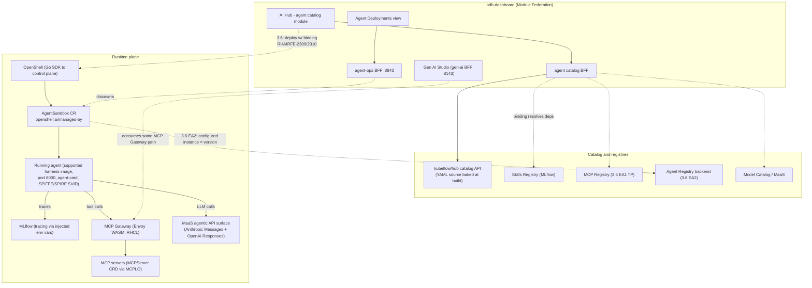

# Agent catalog architecture — RHOAI integration map and 3.6 deploy path

## Snapshot and method

Standing context used: **`architecture/rhoai-3.5-ea.2`** in [opendatahub-io/architecture-context](https://github.com/opendatahub-io/architecture-context) — the newest concrete snapshot (generated 2026-06-22, 65 components; newer than the `rhoai-3.4*` examples suggested; `rhoai.next` and symlinks like `newest` also exist). Docs pulled: `PLATFORM.md`, `agents-operator.md`, `odh-dashboard.md`, `mlflow.md`, `models-as-a-service.md`, `rhoai-mcp.md`, `kubeflow.md`, plus the snapshot `README.md`.

What the snapshot **covered well**: the operator hierarchy, the dashboard's module-federation/BFF architecture (including a new `agent-ops` BFF), the three ingress generations, MaaS internals, model registry catalog sources, and the agents-operator's sidecar identity model.

What it **did not cover** — supplied instead from local hub knowledge and web fetches:
- **No `kubeflow/hub` component doc.** The snapshot's `kubeflow.md` is the *notebook controller*, not the catalog backend. The Agent/MCP/Model catalog backend ([kubeflow/hub](https://github.com/kubeflow/hub), the renamed model-registry — [/features/platform/knowledge/decision-kubeflow-hub-rename.md](/features/platform/knowledge/decision-kubeflow-hub-rename.md)) has no dedicated summary.
- **No AI Hub functional doc** and no agent-catalog BFF — expected: the snapshot (June 22) predates the BFF build, which started after the OpenAPI spec merged 2026-07-03 ([/features/agent-catalog/knowledge/fact-agent-catalog-35-scope.md](/features/agent-catalog/knowledge/fact-agent-catalog-35-scope.md)).
- **It documents Kagenti** (`agents-operator.md`), while the roadmap has since moved the agent-runtime bet to **OpenShell** ([/features/agent-registry/knowledge/fact-kagenti-roadmap-removal.md](/features/agent-registry/knowledge/fact-kagenti-roadmap-removal.md)). Treat the Kagenti doc as design-concept reference, not the 3.6 plan of record.

---

## 1. RHOAI platform architecture as it stands (citable baseline)

Per the `rhoai-3.5-ea.2` `PLATFORM.md`:

- **Operator.** `rhods-operator` manages everything through a hierarchical controller pattern: `DSCInitialization` → `DataScienceCluster` → per-component controllers — 26 operator-based components, 138 CRDs, across 31 repositories, with a module system for out-of-tree extensions.
- **Dashboard.** `odh-dashboard` is the central control plane (22 outgoing integration points), a **Webpack Module Federation micro-frontend host** loading remote modules from **BFF sidecars** in the same pod (ports 8043–8843): model-registry (8043 — registry proxy, *model catalog, MCP server discovery*), gen-ai (8143), maas (8243), mlflow (8343), eval-hub (8543), automl (8643), autorag (8743), **agent-ops (8843 — AgentRuntime CRs, MCP tool discovery)**, plus a Go core-bff and the Node.js/Fastify host backend. Auth: kube-rbac-proxy → TokenReview → `x-forwarded-access-token` → per-BFF SubjectAccessReview.
- **AI Hub** is a UI construct on this dashboard, not a component: Catalog / Registry / Deployments tabs per asset type, PatternFly ([/features/platform/knowledge/fact-ai-hub-ui.md](/features/platform/knowledge/fact-ai-hub-ui.md)). Admin-facing governance surfaces live here; consumption lives in Gen AI Studio.
- **Serving.** KServe is the serving control plane (traditional `InferenceService` v1beta1 via Routes + kube-rbac-proxy; LLM-optimized `LLMInferenceService` v1alpha2 via Gateway API with the llm-d ecosystem for KV-cache-aware routing).
- **MaaS.** maas-controller / maas-api / payload-processing on **Envoy Gateway + Kuadrant** (AuthPolicy, TokenRateLimitPolicy, Authorino callbacks). The `ext_proc` pipeline does pre-auth model-name extraction and **post-auth API-format translation + provider credential injection** — an OpenAI-compatible surface (`/v1/models`, `sk-oai-*` keys) that can proxy to external providers. This is the mechanical substrate for the planned **agentic API surface** (Anthropic Messages API + OpenAI Responses API with runtime model-name translation — [/features/agent-catalog/knowledge/fact-agent-deployment-modes.md](/features/agent-catalog/knowledge/fact-agent-deployment-modes.md), [/features/platform/knowledge/ref-open-responses-specification.md](/features/platform/knowledge/ref-open-responses-specification.md)).
- **Model registry / catalog.** Model Registry stores metadata in PostgreSQL (ml-metadata gRPC); the catalog aggregates registered models, ConfigMap catalogs, and `model-metadata-collection` OCI-shipped catalogs. Upstream this is now **kubeflow/hub** — Model Registry + Catalog with federated discovery, MCP servers and agents as asset types ([kubeflow/hub](https://github.com/kubeflow/hub)).
- **Ingress generations.** Legacy Istio VirtualService → OpenShift Routes + kube-rbac-proxy → **Gateway API HTTPRoutes + Kuadrant/Authorino** (MaaS, LLMInferenceService, Model Registry). The rhods-operator Gateway controller assembles Envoy + ext_authz EnvoyFilters + kube-auth-proxy at reconcile time.
- **Agentic components in the snapshot.** `agents-operator` (Kagenti design: AgentRuntime/AgentCard/AuthorizationPolicy CRDs, AuthBridge sidecar doing JWT validation/token exchange/OPA, SPIFFE/SPIRE SVIDs, JWS-signed agent cards, **MLflow auto-discovery + tracking env-var injection**, support for `agents.x-k8s.io/Sandbox` workloads); `rhoai-mcp` (the OpenShift AI MCP server — platform operations as MCP tools, SSE/streamable-HTTP, per-tool RBAC); `mlflow` (tracking, model registry, OTLP trace ingestion, federated trace-view modules).

---

## 2. Agent Catalog integration map

The Agent Catalog is "v3" of the Model → MCP → Agent catalog pattern (Andrew Ballantyne): kubeflow/hub backend, YAML catalog source baked at build time, AI Hub federated UI ([/features/agent-catalog/knowledge/fact-agent-catalog-overview.md](/features/agent-catalog/knowledge/fact-agent-catalog-overview.md)). In 3.5 it is read-only (cards link out to GitHub, no deploy — [/features/agent-catalog/knowledge/decision-agent-catalog-no-deploy-35.md](/features/agent-catalog/knowledge/decision-agent-catalog-no-deploy-35.md)); at 3.6 EA1 it grows a deploy path.



Per sibling feature — **today (3.5)** vs **planned (3.6)**:

| Feature | Today (3.5) | Planned (3.6) |
|---|---|---|
| **mcp-catalog** | Pattern donor, not a data-flow peer: same kubeflow/hub backend, same YAML-source→image→DB disconnected pipeline, same AI Hub card/detail UX; MCP admin UI took priority over the agent one ([/features/mcp-catalog/knowledge/fact-mcp-catalog-overview.md](/features/mcp-catalog/knowledge/fact-mcp-catalog-overview.md)) | Both catalogs converge on TP/GA in 3.6; MCP's discover→deploy→connect→consume chain is the template the agent deploy flow imitates |
| **mcp-registry** | No integration — registry DP missed 3.5 stable ([/memory/profiles/roadmap.md](/memory/profiles/roadmap.md)) | Declarative binding (RHAIRFE-2309) resolves an agent's declared MCP servers against registry entries; open question how registry governance state (approval/certification) should gate what an agent may bind to |
| **mcp-gateway** | Not required; Gen AI Studio reaches MCP servers via the `gen-ai-aa-mcp-servers` ConfigMap ([/features/mcp-gateway/knowledge/fact-mcp-gateway.md](/features/mcp-gateway/knowledge/fact-mcp-gateway.md)) | Deployed agents get gateway-mediated MCP access: Envoy WASM plug-in in the RHCL stack (MCP Router ext_proc → Broker), identity-aware per-tool authz pairing with agent SPIFFE identity; Jehlum's bootstrap proposal preconfigures supported harnesses with a platform skill + the OpenShift AI MCP server "ideally through the MCP Gateway" ([/features/agent-catalog/knowledge/ref-platform-skills-for-harnesses-gdoc.md](/features/agent-catalog/knowledge/ref-platform-skills-for-harnesses-gdoc.md)); Gateway GA rides RHCL 1.5 (Oct 2026) |
| **mcp-lifecycle-operator** | The deploy-side analog: MCPServer CRD (`mcp.x-k8s.io/v1alpha1`) is what "deploy from catalog" already means for MCP servers; TP mid-Aug 2026 | Indirect: catalog-deployed agents consume MCPLO-deployed servers (via gateway); MCPLO GA scope (OCPSTRAT-2879) explicitly adds Agent Sandbox/Code Mode support — the two runtimes meet at the CR layer ([/features/mcp-lifecycle-operator/knowledge/index.md](/features/mcp-lifecycle-operator/knowledge/index.md)). Note the contrast: agents get an SDK-driven deploy (OpenShell), not a CRD-first operator like MCPLO |
| **agent-registry** | None shipped. Semantics agreed in principle: catalog = seeds/templates, a configured deployed instance = a **version** in the registry (Adel — [/features/agent-catalog/knowledge/fact-agent-deployment-modes.md](/features/agent-catalog/knowledge/fact-agent-deployment-modes.md)) | Backend 3.6 EA2 (RHAISTRAT-1436, UI later RHAIRFE-1313), likely MLflow-based (`AgentDiscoveryProvider` poll/watch/webhook could watch AgentSandbox CRs — [/features/agent-registry/knowledge/fact-agent-registry.md](/features/agent-registry/knowledge/fact-agent-registry.md)); whether Deploy becomes "Register" is unresolved (ODH ADR #142 — [/features/agent-catalog/knowledge/question-agent-catalog-register-vs-deploy.md](/features/agent-catalog/knowledge/question-agent-catalog-register-vs-deploy.md)) |
| **agent-interop / OpenShell** | Read-only deployments view discovers AgentSandbox CRs labeled `openshell.ai/managed-by` (agent-ops BFF); OpenShell DP ships in 3.5 ([/features/agent-interop/knowledge/fact-agent-interop-overview.md](/features/agent-interop/knowledge/fact-agent-interop-overview.md)) | The deploy target: BFF → **OpenShell Go SDK** (Gage: the SDK is "our blocker"; [NVIDIA/OpenShell#2044](https://github.com/NVIDIA/OpenShell/issues/2044), rhuss/openshell-sdk-go prototype). OpenShell provides gateway control plane, sandbox, policy engine, privacy router ([NVIDIA/OpenShell](https://github.com/NVIDIA/OpenShell)); identity is SPIFFE/SPIRE with token exchange ([/features/agent-interop/research/00-executive-summary.md](/features/agent-interop/research/00-executive-summary.md)) |
| **gen-ai-studio** | Separate persona surface (AI Engineers), no direct catalog integration; harness-in-playground explicitly not 3.5 (needs session management, HITL, tool approval — [/features/agent-catalog/knowledge/question-agent-catalog-harness-playground-integration.md](/features/agent-catalog/knowledge/question-agent-catalog-harness-playground-integration.md)) | Shares two rails with deployed agents: the MCP Gateway consumption path and the unsolved user-identity flow-through question; its AI Available Assets view is the natural future home for agent endpoints |
| **skills-registry** | Upstream-only (MLflow MVP: SKILL.md + frontmatter, `install_skill()` into harness dirs — [/features/skills-registry/knowledge/index.md](/features/skills-registry/knowledge/index.md)) | Binding target for Mode 2: declared skills resolve against the skills registry; skills ship at most as "tested with these models"; PVC-mounted skills-as-markdown floated as the disconnected workaround ([/features/agent-catalog/knowledge/fact-agent-catalog-36-supported-images.md](/features/agent-catalog/knowledge/fact-agent-catalog-36-supported-images.md)) |
| **model catalog / MaaS** | Pattern v1 (same hub backend); no runtime link | Two links: binding resolves the agent's declared model against the model catalog/MaaS; at runtime the harness talks to the **agentic API surface** (Anthropic Messages + OpenAI Responses) whose translation/credential-injection machinery MaaS `ext_proc` already implements in 3.5-ea.2; catalog cards carry an optional "tested models" field ([/features/agent-catalog/knowledge/decision-agent-catalog-35-field-set.md](/features/agent-catalog/knowledge/decision-agent-catalog-35-field-set.md)) |
| **platform AI Hub UI/BFF** | Agent catalog is a federated module + its own BFF under `ai-hub/agents/catalog` (Razzmatazz team; build started after the 2026-07-03 spec merge); `settings/agent-resources` admin UI cut from 3.5 | Detail page grows the deploy button (detail-page-only per the field-set decision); admin UI returns later following the MCP admin-UI template |

---

## 3. Deploy-path reference architecture for 3.6

The container contract predates the flow and survives it: port 8000, `/.well-known/agent-card.json`, non-root (USER 1000), all config via env vars ([/features/agent-catalog/knowledge/fact-agent-catalog-starter-kits.md](/features/agent-catalog/knowledge/fact-agent-catalog-starter-kits.md)). Deploy is restricted to **supported** (platform-built, not vendor-"validated") harness images ([/features/agent-catalog/knowledge/decision-agent-catalog-deploy-supported-images-only.md](/features/agent-catalog/knowledge/decision-agent-catalog-deploy-supported-images-only.md), [/features/agent-catalog/knowledge/decision-supported-not-validated-images.md](/features/agent-catalog/knowledge/decision-supported-not-validated-images.md)), built on AIPCC agent-runtime base images (RHAIRFE-2443; ADR fit still questioned).

```mermaid
sequenceDiagram
    actor U as User (AI Hub)
    participant BFF as Agent catalog BFF
    participant HUB as kubeflow/hub catalog API
    participant BIND as Binding (RHAIRFE-2309)
    participant OS as OpenShell (Go SDK)
    participant A as Agent pod (supported harness)
    participant GW as MCP Gateway
    participant MAAS as MaaS agentic API
    participant MLF as MLflow

    U->>BFF: browse catalog / open card
    BFF->>HUB: GET /agents, /agents/{id}/artifacts (agent.yaml)
    U->>BFF: detail page, Deploy (declarative spec, RHAIRFE-2310)
    BFF->>BIND: resolve declared model / MCP servers / skills
    BIND-->>BFF: bound refs (model catalog+MaaS, MCP registry, skills registry)
    BFF->>OS: create sandbox (Go SDK)
    OS->>A: AgentSandbox CR (openshell.ai/managed-by) creates pod
    Note over A: SPIFFE/SPIRE SVID identity,<br/>token exchange, policy engine,<br/>MLflow tracing env vars injected
    A->>MAAS: LLM calls (Anthropic Messages / OpenAI Responses,<br/>model-name translation, credential injection)
    A->>GW: MCP tool calls (identity-aware per-tool authz)
    A->>MLF: OTLP traces
    A-->>U: agent-card at /.well-known/agent-card.json;<br/>listed in Deployments view (agent-ops BFF)
    Note over OS: 3.6 EA2 - configured instance registered<br/>as a version in the Agent Registry
```

**Where binding fits.** The declarative harness (RHAIRFE-2310 spec + RHAIRFE-2309 binding — [/features/agent-interop/knowledge/ref-declarative-harness-proposal-gdoc.md](/features/agent-interop/knowledge/ref-declarative-harness-proposal-gdoc.md)) is the step between "Deploy clicked" and "OpenShell called": it turns the user's declared configuration into concrete platform references. It is the *only* piece of this path with no MCP Catalog precedent, and Bill Murdock flags full binding as "extremely ambitious" for 3.6 — a plausible descope is deploy-with-manual-config first, binding later. Mode 1 (bring-your-own image, sidecar contract via docs) remains documentation-only.

---

## 4. Architectural risks and tension points

1. **Two sources of agent truth.** Catalog (kubeflow/hub, seeds/templates) vs Agent Registry (MLflow direction, configured versions) is agreed rhetoric but unresolved mechanics: must deployments register? Does Deploy become Register? Andrew Ballantyne argues flows can't be forced through a registry (GitOps/`oc apply` can't be policed); a sync-operator ADR seed exists (ODH ADR #142) ([/features/agent-catalog/knowledge/question-agent-catalog-register-vs-deploy.md](/features/agent-catalog/knowledge/question-agent-catalog-register-vs-deploy.md)). The MCP side has the same split, so whatever the agent flow decides will set precedent — or inherit the MCP decision late.
2. **Ghost agents.** OpenShell cannot adopt resources it did not spawn (Derek Carr, 2026-07-14): anything deployed as an AgentSandbox in 3.5 becomes a read-only ghost under 3.6 OpenShell. Low blast radius now (3.5 has no deploy button), but it makes the 3.5 deployments view a dead-end surface and sets a migration-story precedent for every future runtime change ([/features/agent-catalog/knowledge/decision-agent-catalog-no-deploy-35.md](/features/agent-catalog/knowledge/decision-agent-catalog-no-deploy-35.md)).
3. **Disconnected vs freshness.** The catalog source is YAML baked into an image at build time (disconnected is mandatory) — so catalog content ages with the release; GitHub slurping is a later enhancement. Worse for the runtime side: baked-in harnesses go stale "within a month," while install-at-runtime breaks disconnected; OpenCode self-updates and may need forking; Ann Marie Fred calls it possibly "an unsolvable problem." And AIPCC, which builds the base images, is out of the loop on the fast-changing catalog contents ([/features/agent-catalog/knowledge/fact-agent-catalog-36-supported-images.md](/features/agent-catalog/knowledge/fact-agent-catalog-36-supported-images.md), [/features/agent-catalog/knowledge/question-agent-catalog-aipcc-base-images-fit.md](/features/agent-catalog/knowledge/question-agent-catalog-aipcc-base-images-fit.md)).
4. **BFF-per-catalog scaling.** The dashboard pod already carries nine BFF sidecars (8043–8843 plus core), and every asset type adds a module + BFF + RBAC surface. Sidecar mode concentrates them in one pod; standalone mode exists but multiplies Deployments. Cross-BFF flows are already appearing (gen-ai ↔ MaaS inter-BFF communication), and the agent deploy path adds BFF → OpenShell SDK — a state-changing dependency the catalog BFFs haven't had before (odh-dashboard.md, rhoai-3.5-ea.2).
5. **Runtime-bet churn vs documentation.** The current architecture snapshot documents Kagenti's agents-operator while the plan of record is OpenShell; the Go SDK the whole 3.6 deploy path depends on is a prototype (rhuss/openshell-sdk-go) against an upstream whose Kubernetes support is explicitly experimental ([NVIDIA/OpenShell](https://github.com/NVIDIA/OpenShell)). Single-dependency risk on one SDK, plus identity-stack gaps (FIPS, SCC, multi-tenancy) that have upstream issues but no downstream RHAISTRAT ([/features/agent-interop/research/00-executive-summary.md](/features/agent-interop/research/00-executive-summary.md)).

---

## 5. Build-vs-reuse observations

**What the MCP Catalog pattern gives for free:** the kubeflow/hub backend and OpenAPI-first API shape (the agent spec merged as hub PR #2907, artifacts endpoint #2928); the YAML-source→image→DB disconnected pipeline; the AI Hub card/detail UX and PatternFly shell; the federated-module + BFF scaffolding; the curation/tier model and, later, the admin-UI template. This is why a read-only agent catalog could ship in one release: it is genuinely "v3" of an existing machine.

**What is genuinely new for agents (the real engineering):**
- **The deploy mechanism.** MCP servers deploy via a CRD and operator (MCPLO); agents deploy via an SDK call into a control plane (OpenShell) that isn't CRD-first — hence the Go SDK blocker and the ghost-agent problem. The industry consensus is drifting CRD-ward (Agent Sandbox SIG, kagent), which may pull this back toward an operator pattern eventually.
- **The binding layer** (RHAIRFE-2309/2310) — resolving declared model/MCP/skills dependencies across three registries at deploy time has no MCP-catalog precedent.
- **Runtime identity and governance** — SPIFFE/SVID per agent, token exchange, signed agent cards, OPA policy; MCP servers are passive endpoints, agents are active identities.
- **The supported-images program** — an ongoing image-maintenance and licensing obligation (Anthropic/Google agreements for Claude Code/Antigravity; Containerfiles for non-redistributables) that a metadata-only catalog never carries.
- **The agentic API surface** — Anthropic Messages + OpenAI Responses translation so third-party harnesses run against platform models; MaaS's ext_proc translation machinery is the reuse candidate here rather than a green-field build.

---

## Candidate knowledge atoms

- The `rhoai-3.5-ea.2` architecture-context snapshot (2026-06-22, 65 components) already documents an **agent-ops BFF (port 8843)** in odh-dashboard managing AgentRuntime CRs and MCP tool discovery — the deployments-view plumbing exists ahead of the catalog deploy path; but it has **no kubeflow/hub component doc** (its `kubeflow.md` is the notebook controller) and still documents **Kagenti**, not OpenShell.
- MaaS's ext_proc pipeline (API-format translation + credential injection, shipped in 3.5-ea.2) is the natural implementation substrate for the 3.6 **agentic API surface** (Anthropic Messages + OpenAI Responses) — reuse candidate, not new build.
- The 3.6 deploy path concentrates on a single dependency: **BFF → OpenShell Go SDK**, currently a prototype (rhuss/openshell-sdk-go; NVIDIA/OpenShell#2044) against an upstream with experimental Kubernetes support.
- Binding (RHAIRFE-2309/2310) is the only step of the catalog→running-agent path with no MCP Catalog precedent — flagged "extremely ambitious" for 3.6; a deploy-without-binding descope is the likely fallback.
- The dashboard pod now carries **nine BFF sidecars**; the agent catalog adds another module+BFF, and the deploy flow makes it the first catalog BFF with a state-changing runtime dependency — the BFF-per-catalog pattern is nearing a scaling decision (sidecar vs standalone).
- The catalog/registry/deployments question ("does Deploy become Register?", ODH ADR #142) is unresolved simultaneously for MCP and agents — whichever side decides first sets the platform-wide precedent.

## Sources

**Architecture-context snapshot (`architecture/rhoai-3.5-ea.2`, generated 2026-06-22):**
- https://github.com/opendatahub-io/architecture-context/blob/main/AGENT_USAGE.md
- PLATFORM.md, odh-dashboard.md, agents-operator.md, mlflow.md, models-as-a-service.md, rhoai-mcp.md, kubeflow.md, README.md under https://github.com/opendatahub-io/architecture-context/tree/main/architecture/rhoai-3.5-ea.2

**External:**
- https://github.com/NVIDIA/OpenShell — OpenShell runtime (gateway/sandbox/policy engine/privacy router; experimental Kubernetes support)
- https://github.com/kubeflow/hub — catalog/registry backend (Model Registry + federated Catalog; MCP servers and agents as asset types)

**Local hub entries (repo-root links):**
- /features/agent-catalog/knowledge/ — overview, 35-scope, 36-supported-images, deployment-modes, starter-kits facts; the four decisions; register-vs-deploy, aipcc-fit, harness-playground questions; platform-skills ref
- /features/agent-interop/knowledge/fact-agent-interop-overview.md · ref-declarative-harness-proposal-gdoc.md · /features/agent-interop/research/00-executive-summary.md
- /features/agent-registry/knowledge/index.md (fact-agent-registry, fact-kagenti-roadmap-removal, fact-agentic-base-images)
- /features/mcp-catalog/knowledge/fact-mcp-catalog-overview.md · /features/mcp-registry/knowledge/index.md · /features/mcp-gateway/knowledge/fact-mcp-gateway.md · /features/mcp-lifecycle-operator/knowledge/index.md
- /features/gen-ai-studio/knowledge/index.md · /features/skills-registry/knowledge/index.md
- /features/platform/knowledge/fact-ai-hub-ui.md · decision-registry-vs-catalog.md · ref-open-responses-specification.md
- /memory/profiles/roadmap.md · /memory/profiles/strategy.md
